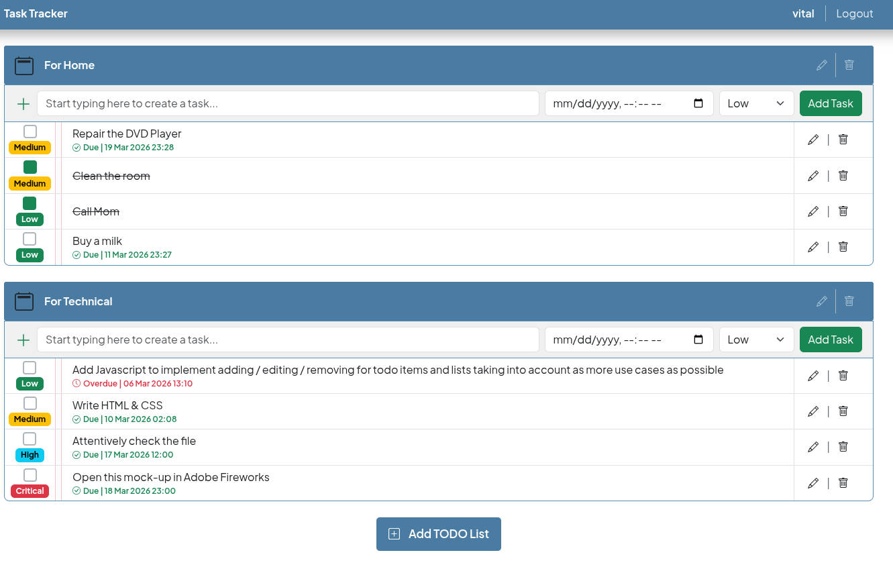
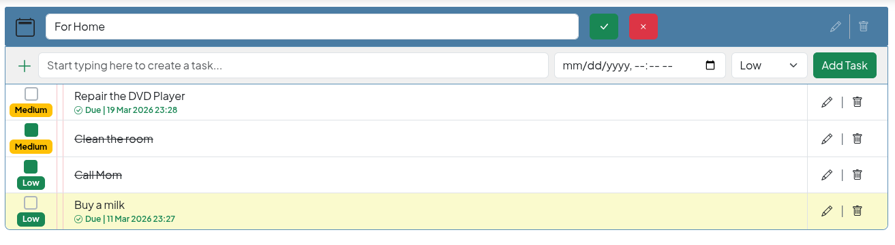
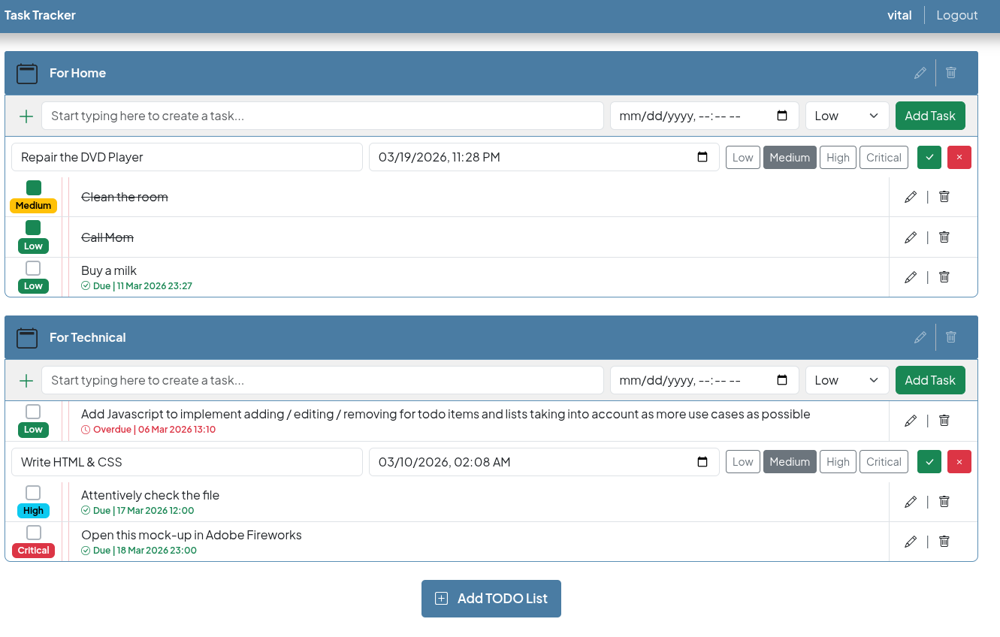
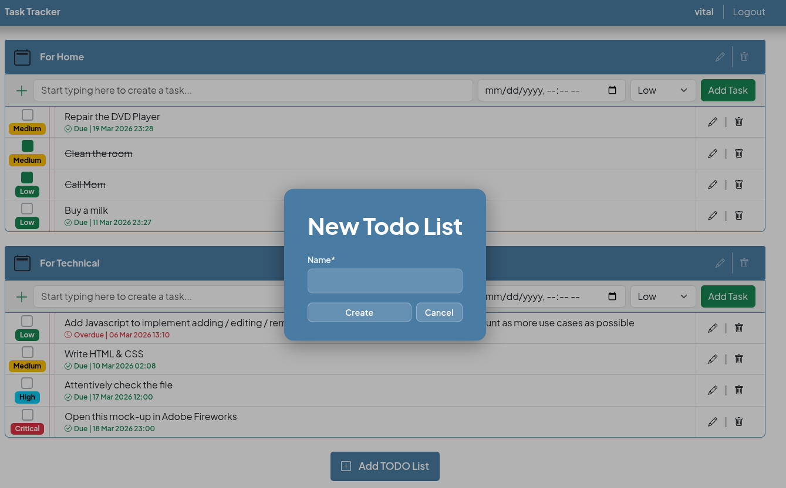

# TaskTracker — Personal Task & Project Manager

> A lightweight, single-page productivity tool built with Django 5.2, HTMX, and Alpine.js.  
> Manage your projects and tasks without ever reloading the page.

---

## 📋 Table of Contents

- [Features](#features)
- [Tech Stack](#tech-stack)
- [Getting Started](#getting-started)
    - [Prerequisites](#prerequisites)
    - [Run with Docker (recommended)](#run-with-docker-recommended)
    - [Run locally without Docker](#run-locally-without-docker)
- [Running Tests](#running-tests)
- [Screenshots](#screenshots)

---

## Features

### Projects

- ➕ Create a new project
- ✏️ Edit a project
- 🗑️ Delete a project
- 👀 View project details

### Tasks

- ➕ Add tasks to any project
- ✏️ Edit task
- 🗑️ Delete a task
- 🔢 Set task priority (Low / Medium / High / Critical)
- 📅 Choose a deadline date
- ✅ Mark a task as done / undone
- 👀 View task details

### UX

- ⚡ Full SPA feel — no page reloads (HTMX + Alpine.js)
- 📱 Fully responsive — works on mobile and desktop (Bootstrap 5 Grid)
- 🔒 User authentication — each user sees only their own data

---

## Tech Stack

Project Technology Stack:

- Language: Python 3.13
- Framework: Django 5.2
- Authentication: django-allauth
- Frontend Interaction: HTMX, Alpine.js, Hyperscript
- Styling: Bootstrap 5
- Linting: Ruff
- Containerization: Docker -> Docker Compose

---

## Getting Started

### Prerequisites

Make sure you have Docker and Docker Compose installed:

> For local development without Docker, you'll also need **Python 3.13** and **pip**.

---

### Run with Docker (recommended)

```bash
# 1. Clone the repository
git clone https://github.com/vitaleoneee/task-tracker.git
cd task-tracker

# 2. Copy and configure environment variables
cp .env.example .env
# Fill the variables in the newly created file with your data
    DB_NAME=your-db-name
    DB_USER=your-db-user
    DB_PASSWORD=your-db-password
    
# 3. Build and start the containers
docker-compose up --build
```

The app will be available at **http://localhost:8000**

To stop the containers:

```bash
docker-compose down
```

---

### Run locally without Docker

```bash
# 1. Clone the repository
git clone https://github.com/vitaleoneee/task-tracker.git
cd task-tracker

# 2. Create and activate a virtual environment
python -m venv .venv
source .venv/bin/activate        # Windows: .venv\Scripts\activate

# 3. Install dependencies
pip install -r requirements.txt

# 4. Copy environment variables
cp .env.example .env
# Fill the variables in the newly created file with your data
    DB_NAME=your-db-name
    DB_USER=your-db-user
    DB_PASSWORD=your-db-password

# 5. Apply migrations
python manage.py migrate

# 6. Create a superuser (optional)
python manage.py createsuperuser

# 7. Start the development server
python manage.py runserver
```

The app will be available at **http://localhost:8000**

---

## Running Tests

```bash
# With Docker
docker compose exec web pytest

# With pytest
pytest
```

---

## Screenshots

### Main page



### Edit Project



### Edit Task



### Create Project Modal

